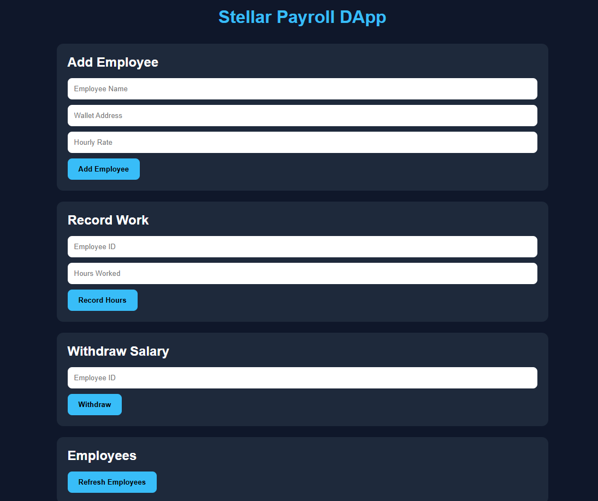

# Stellar Payroll DApp

**Stellar Payroll DApp** - Blockchain-Based Automated Payroll & Micro-Invoicing System

## Project Description

Stellar Payroll DApp is a decentralized payroll automation solution built on the Stellar blockchain using Soroban SDK. The platform enables businesses, startups, and freelancers to automate salary payments and invoice processing directly on-chain using smart contracts.

The system is designed for hourly workers, freelancers, and milestone-based contractors. Employers can securely deposit payroll funds into the smart contract, while the contract automatically calculates and distributes payments based on recorded work hours or completed milestones.

By leveraging the speed and low transaction fees of Stellar, the platform removes the need for manual monthly bank transfers, reduces payroll overhead, and ensures transparent and tamper-proof salary management.

Each employee or freelancer has a dedicated payroll record stored on-chain, including:
- Hourly payment rate
- Completed working hours
- Pending salary balance
- Wallet address for automated payouts

The contract guarantees transparent, secure, and automated payroll execution without relying on centralized payroll providers.

---

# Project Vision

Our vision is to modernize workforce payments through decentralized finance infrastructure by:

- **Automating Payroll Systems**: Eliminating manual salary calculations and monthly transfer processes
- **Empowering Freelancers**: Giving workers direct and transparent access to their earnings
- **Reducing Payment Delays**: Enabling instant and programmable salary distribution
- **Improving Transparency**: Making payroll records auditable and verifiable on-chain
- **Lowering Operational Costs**: Reducing reliance on expensive payroll intermediaries
- **Supporting Global Workforces**: Allowing borderless payments using blockchain-based stablecoins such as USDC
- **Building Trustless Employment Systems**: Ensuring salary execution is controlled by code rather than centralized institutions

We envision a future where companies can pay global talent instantly, transparently, and automatically using decentralized smart contracts.

---

# Key Features

## 1. Automated Employee Registration

- Register employees or freelancers directly on-chain
- Assign wallet addresses for automated payments
- Define hourly rates or milestone compensation
- Persistent decentralized payroll records

## 2. Work Hour Tracking

- Record completed work hours through smart contract functions
- Support integration with attendance systems or external oracle services
- Automatically update total payable balances
- Transparent on-chain time tracking

## 3. Automated Salary Calculation

- Smart contract calculates salary instantly based on:
  - Hourly rates
  - Completed hours
  - Milestone completion
- Eliminates manual payroll computation
- Prevents payroll manipulation and calculation errors

## 4. Instant Payroll Withdrawal

- Employees can withdraw earned salary directly to their wallet
- Supports automated USDC payouts on Stellar
- Reduces payment waiting periods
- Enables real-time access to earnings

## 5. Secure Employer Fund Management

- Employer deposits payroll funds into the contract
- Smart contract securely manages payroll reserves
- Prevents unauthorized access to salary funds
- Transparent balance management

## 6. Transparency & Auditability

- All payroll activities are recorded on-chain
- Salary calculations can be publicly verified
- Immutable payment history
- Fully traceable payroll operations

## 7. Stellar Network Integration

- Powered by Stellar's high-speed blockchain infrastructure
- Low transaction fees for global payroll
- Built using Soroban Smart Contract SDK
- Compatible with Stellar-based stablecoins such as USDC

---

# Contract Details

- Contract Address: CBONPZG7E7ZANOTDM6AQQ4VJABO2BCOOEXPPKNGKWNNX5N2RIVSOS6VK

---

# Future Scope

## Short-Term Enhancements

1. **USDC Token Integration**
   - Real token transfers using Stellar USDC
   - Automated stablecoin payroll disbursement

2. **Employer Treasury Management**
   - Deposit and reserve payroll liquidity
   - Multi-payment scheduling

3. **Milestone-Based Payments**
   - Support fixed-price freelance contracts
   - Automatic milestone verification

4. **Payroll Dashboard**
   - Frontend interface for employers and workers
   - Real-time payroll analytics

---

## Medium-Term Development

5. **Streaming Salary Payments**
   - Continuous salary streaming per second/minute
   - Real-time wage accrual systems

6. **Oracle Integration**
   - Integration with attendance APIs or productivity systems
   - Automated work verification

7. **Multi-Employee Payroll Batches**
   - Mass payroll processing
   - Enterprise-scale salary execution

8. **Notification System**
   - Alerts for completed payments and salary claims
   - Email or wallet notifications

9. **Role-Based Access Control**
   - Admin, employer, and employee permissions
   - Secure payroll authorization layers

---

## Long-Term Vision

10. **Cross-Border Payroll Infrastructure**
    - Global workforce payment network
    - Multi-currency settlement support

11. **DAO Workforce Management**
    - Decentralized contributor payment governance
    - Community-managed payroll systems

12. **AI Payroll Optimization**
    - Automated payroll prediction and analytics
    - Smart budgeting recommendations

13. **Cross-Chain Payroll Support**
    - Interoperability with multiple blockchain networks
    - Unified decentralized payroll infrastructure

14. **Decentralized Identity Integration**
    - DID-based worker verification
    - Secure decentralized employee profiles

---

# Enterprise Features

15. **Corporate Payroll Automation**
    - Enterprise-grade workforce management
    - Automated salary cycles

16. **Compliance Reporting**
    - Immutable payroll logs for auditing
    - Tax and financial reporting integration

17. **Contractor Marketplace Integration**
    - Automated freelancer payments
    - Escrow-based project funding

18. **Global Workforce Infrastructure**
    - Multi-language and multi-region payroll support
    - Borderless contractor onboarding

---

# Technical Requirements

- Soroban SDK
- Rust Programming Language
- Stellar Blockchain Network
- Stellar USDC Asset Integration

---

# Getting Started

Deploy the smart contract to Stellar's Soroban network and interact with the following core functions:

- `add_employee()`  
  Register a new employee or freelancer

- `get_employees()`  
  Retrieve all employee payroll data

- `record_work()`  
  Record completed work hours and automatically calculate salary

- `withdraw_salary()`  
  Withdraw earned salary to employee wallet

- `delete_employee()`  
  Remove employee data from the contract

---

# Workflow Overview

1. Employer deposits payroll funds
2. Employee completes work
3. Work hours or milestones are submitted
4. Smart contract automatically calculates salary
5. Salary balance updates instantly
6. Employee withdraws USDC payment directly from the contract

---

**Stellar Payroll DApp** — Automating Global Payroll with Blockchain Technology